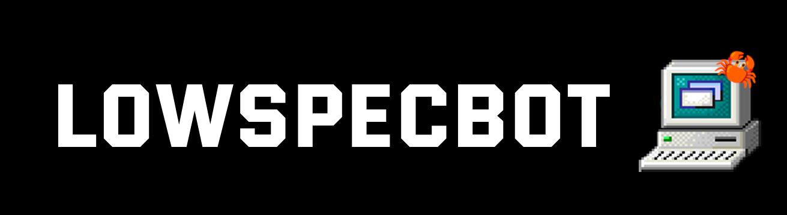

# 🦀 LowSpecBotRust

**📖 Description:** Discord Bot whose purpose is to serve at LowSpecGuys Discord Server. Now in Rust!

## 📚 Made with:

-   Rust
-   Serenity
-   Poise

## 🏅 Features (TODO):

-   Modular and expandable commands!
-   Help commands expands as much as the commands do!
-   Settings on a .json file!
-   Kick, ban and soft-ban from a server!
-   Avatar display!
-   Clean spam command!
-   8ball (random phrases)!
-   Toggleable random responses!
-   Mutes & unmutes everyone on a voice channel! (Useful for games such as Among Us!)
-   Text to emoji!

## ❓ How to (TODO):

**❗ IMPORTANT NOTE:** The bot will only initialize with the proper token key, so you have to use your **OWN BOT TOKEN** to use this code.

1. Clone repository / Download source code.
2. 🎉 Congratulations! 🎉 The bot is now executing on your machine! 👏👏👏

## 📣 Special Thanks:

**💡 Authors:** [Neutrovertido](https://github.com/Neutrovertido/) & [GASC1211](https://github.com/Gasc1211/)
